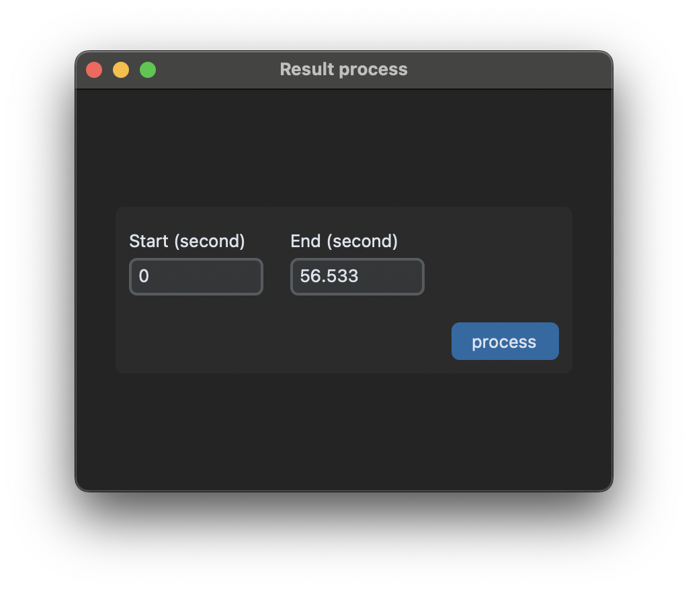
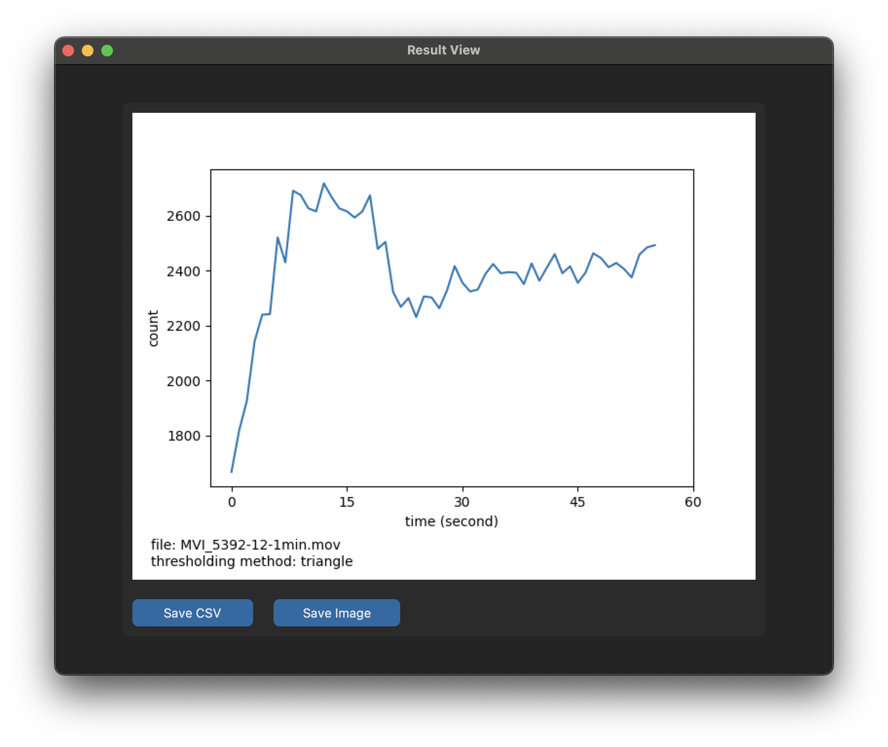

# **COMOT: Cell Counting and Motility Observation Tool**
[](https://github.com/charliermarsh/ruff) [](https://github.com/d191761/comot/blob/main/LICENSE.md)

**COMOT** is a Python-based software tool designed to automate microbial cell counting and motility measurement through image processing and computer vision techniques. It is built using [OpenCV](https://github.com/opencv/opencv-python) for processing and [customtkinter](https://github.com/TomSchimansky/CustomTkinter) for the user interface. Currently, it supports `.mp4` and `.mov` file formats.


---

## **Installation**

First ensure that [ffmpeg](https://ffmpeg.org/download.html) has already installed in your system.

### **Windows Binary**

A pre-compiled Windows version is available in the [releases](https://github.com/d191761/comot/releases) section. Follow these steps to use it:
1. Download the `.zip` file from the release page.
2. Extract the contents of the `.zip` file.
3. Navigate to the `app` folder.
4. Run `app.exe` to launch the tool.

### **Running from Python (MacOS, Windows, Linux)**

To run the tool from Python, follow these steps:

1. **Set up a Python environment:**
   - Create and activate a Python environment using either `venv` or `conda`.

2. **Install COMOT:**
   - Navigate to the `comot` folder in the repository.
   - Run the following command:
     ```bash
     pip install -e .
     ```

3. **Run the application:**
   - Navigate to the `app` folder.
   - Start the application by running:
     ```bash
     python app.py
     ```

* Tested on `macOS Sequioa 15.1.1, Windows 10 10.0.19045, MX Linux 23`
---

## **Usage**

1. **Load video:**
   - Open the application and load the video file you want to analyze using `Load Video` button.

2. **Masking uncounted area:**
   - Use the masking tool to exclude uncounted area due to protruding experimental probe or undesired regions, by clicking on the image area then click `masking` button when done.

3. **Main window:**
   - After masking, the main window will appear. Refer to the annotated image below for details about each component:


4. **Proceed to analysis:**
   - Click the `Results` button.

5. **Set time range:**
   - Specify the start and end times for analysis (in second).


6. **Confirm and process:**
   - Confirm and process: Click `process` to execute the cell counting with the desired settings.

7. **Save results:**
   - Once the analysis is complete, save the results as either `.csv` or `.png`.


---
## Dataset

The demo dataset used in the paper can be downloaded trough this [link](https://www.kaggle.com/datasets/d191761/comot-demo)

